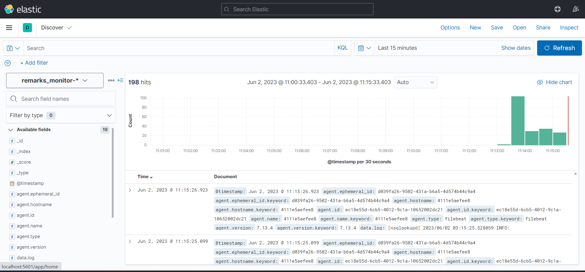
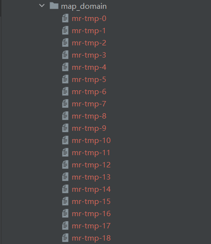

# remarks_monitor

一款基于gozero的微服务分布式言论管控平台，搭载有完整的链路追踪、服务监控和日志管理系统

应用场景：在2077年，荒坂集团为了对夜之城的居民的言论进行严格的管控，针对 **用户名，访问的域名，违禁词，发送时间**进行**监测**并方便实施打击


README持续施工中。。


------

## 技术栈

| 功能               | 实现                                      |
| :----------------- | :---------------------------------------- |
| http框架           | gozero                                    |
| rpc框架            | gozero                                    |
| 数据库             | MongoDB、MySQL、Redis                     |
| 访问控制           | casbin                                    |
| 服务发现与配置中心 | consul                                    |
| 链路追踪           | jaeger                                    |
| 服务监控           | prometheus，grafana                       |
| 消息队列           | kafka                                     |
| 日志管理           | filebeat，go-stash，elasticsearch，kibana |
| 网关               | traefik                                   |

## 架构图

https://excalidraw.com/#json=fNEX_332YTuzOPvuiYCes,ArMrpKtpwo8e8LfNC_BR2A


## 结构介绍

```
├─app
│  ├─casbin **权限控制**
│  ├─input **输入**
│  │  ├─cmd
│  │  │  ├─api
│  │  │  │  ├─etc
│  │  │  │  └─internal
│  │  │  │      ├─config
│  │  │  │      ├─handler
│  │  │  │      ├─logic
│  │  │  │      ├─svc
│  │  │  │      └─types
│  │  │  └─rpc
│  │  │      ├─etc
│  │  │      ├─input
│  │  │      ├─internal
│  │  │      │  ├─config
│  │  │      │  ├─logic
│  │  │      │  ├─server
│  │  │      │  └─svc
│  │  │      └─pb
│  │  └─model
│  ├─map1 **map工作节点**
│  │  └─cmd
│  │      └─rpc
│  │          ├─etc
│  │          ├─internal
│  │          │  ├─config
│  │          │  ├─logic
│  │          │  ├─server
│  │          │  └─svc
│  │          ├─map1
│  │          └─mapwork
│  ├─map2
│  │  └─cmd
│  │      └─rpc
│  │          ├─etc
│  │          ├─internal
│  │          │  ├─config
│  │          │  ├─logic
│  │          │  ├─server
│  │          │  └─svc
│  │          ├─map2
│  │          └─mapwork
│  ├─map3
│  │  └─cmd
│  │      └─rpc
│  │          ├─etc
│  │          ├─internal
│  │          │  ├─config
│  │          │  ├─logic
│  │          │  ├─server
│  │          │  └─svc
│  │          ├─map3
│  │          └─mapwork
│  ├─master **数据处理管理节点**
│  │  ├─cmd
│  │  │  ├─api
│  │  │  │  ├─etc
│  │  │  │  └─internal
│  │  │  │      ├─config
│  │  │  │      ├─handler
│  │  │  │      │  └─master
│  │  │  │      ├─logic
│  │  │  │      │  └─master
│  │  │  │      ├─svc
│  │  │  │      └─types
│  │  │  └─rpc
│  │  │      ├─etc
│  │  │      ├─internal
│  │  │      │  ├─config
│  │  │      │  ├─logic
│  │  │      │  ├─server
│  │  │      │  └─svc
│  │  │      ├─master
│  │  │      └─pb
│  │  └─model
│  ├─reduce1 **reduce工作节点**
│  │  └─cmd
│  │      └─rpc
│  │          ├─etc
│  │          ├─internal
│  │          │  ├─config
│  │          │  ├─logic
│  │          │  ├─server
│  │          │  └─svc
│  │          ├─reduce1
│  │          └─reducework1
│  ├─reduce2
│  │  └─cmd
│  │      └─rpc
│  │          ├─etc
│  │          ├─internal
│  │          │  ├─config
│  │          │  ├─logic
│  │          │  ├─server
│  │          │  └─svc
│  │          ├─reduce2
│  │          └─reducework2
│  └─usercenter **用户中心**
│      ├─cmd
│      │  ├─api
│      │  │  ├─etc
│      │  │  └─internal
│      │  │      ├─config
│      │  │      ├─handler
│      │  │      │  └─user
│      │  │      ├─logic
│      │  │      │  └─user
│      │  │      ├─svc
│      │  │      └─types
│      │  └─rpc
│      │      ├─etc
│      │      ├─internal
│      │      │  ├─config
│      │      │  ├─logic
│      │      │  ├─server
│      │      │  └─svc
│      │      ├─pb
│      │      └─usercenter
│      └─model
├─common
│  ├─ctxdata **JWT相关**
│  └─tool **工具**
├─data
│  ├─elasticsearch **日志处理数据**
│  │  └─data
│  │      └─nodes
│  │          └─0
│  ├─grafana **监控数据**
│  │  └─data
│  │      ├─csv
│  │      ├─plugins
│  │      └─png
│  ├─prometheus **监控数据**
│  │  └─data
│  └─remarks_monitor **数据处理**
│      ├─input
│      ├─map_content
│      ├─map_domain
│      ├─map_username
│      └─reduce
│          ├─content
│          ├─domain
│          └─username
├─deploy **组件管理**
│  ├─filebeat
│  │  └─conf
│  ├─go-stash
│  │  └─etc
│  ├─prometheus
│  │  └─server
│  └─traefik
├─doc 
└─test **测试**
```


## 功能演示

### traefik


### prometheus


### grafana


### jaeger


### consul


### casbin

```go
var e *casbin.Enforcer

func InitCasbin() {

	// 使用MySQL数据库初始化一个gorm适配器
	a, err := gormadapter.NewAdapter("mysql", "root:%@tcp(127.0.0.1:3306)/")
	if err != nil {
		log.Fatalf("error: adapter: %s", err)
	}

	m, err := model.NewModelFromString(`
[request_definition]
r = sub, obj, act

[policy_definition]
p = sub, obj, act

[policy_effect]
e = some(where (p.eft == allow))

[matchers]
m = r.sub == p.sub && r.obj == p.obj && r.act == p.act
`)
	if err != nil {
		log.Fatalf("error: model: %s", err)
	}

	e, err = casbin.NewEnforcer(m, a)
	if err != nil {
		log.Fatalf("error: enforcer: %s", err)
	}
}

func GetEnforcer() *casbin.Enforcer {
	return e
}

func CheckPermission(user, action, resource string) bool {
	enforcer := GetEnforcer()

	// 进行权限检验
	result, err := enforcer.Enforce(user, resource, action)
	if err != nil {
		logx.Error(err)
		return false
	}

	return result
}

func AddPermission(user, action, resource string) bool {
	enforcer := GetEnforcer()

	result, err := enforcer.AddPolicy(user, resource, action)
	if err != nil {
		logx.Error(err)
		return false
	}
	return result
}

func RemovePermission(user, action, resource string) bool {
	enforcer := GetEnforcer()

	result, err := enforcer.RemovePolicy(user, resource, action)
	if err != nil {
		logx.Error(err)
		return false
	}
	return result
}
```

#### elasticsearch


#### kibana




### 项目功能

#### 用户中心操作

比较简单，直接粘 api 文件展示


#### 输入/上传数据


#### 数据处理(MapReduce)

手搓了100个文件，大概1个G，2000万条数据


**管理员**根据所需文件类型分为 **用户名**、**域名**、**文本内容**进行所需类型的当日数据处理


map 节点生成的中间文件




reduce 节点工作输出文件


写入数据库后最终结果


#### 数据查询

管理员根据 **数据类型，偏移量，含量大小**进行降序查询


## 数据库设计

casbin


mysql 用户账号密码，密码经过md5加密处理


mongodb 数据存储


## MapReduce实现及性能


核心思想是**分而治之**

- 将原始文件分成若干个16-64M的文件（这一步我已省略），共有三种节点，**master**，**worker**，**reduce**
- 其中 master 节点唯一存在，worker 节点数量是 reduce 节点的几倍
- Master 节点获取任务需求并把任务分发给 map 节点并发执行任务，map 节点把数据分成若干条键值对储存到磁盘，并把新文件地址告知 reduce节点
- reduce节点获取键值对文件位置之后将其遍历整合成到若干个输出文件中，最后告知 master 节点


**容错性**

​	如果其中一个工作节点挂掉，并不会导致整个程序崩溃。但是如果其中一个节点因为硬件老化等原因运行性能大大下降，处理速度是一般情况下的1/1000，这种情况会拖慢整体的进程。

​	我设计的是如果其中有节点出现这种情况，任务长时间未完成，master节点会通知其他的工作节点处理相同的任务并同步输出,同时保证了并发安全


**性能**：

​	另写了一个单体纯算法的对照组

```go
package main

import (
	"bufio"
	"fmt"
	"net/http"

	_ "net/http/pprof"
	"os"
	"remarks_monitor/common/tool"
	"strconv"
	"time"
)

func main() {
	http.HandleFunc("/hello", func(writer http.ResponseWriter, request *http.Request) {
		fmt.Println(time.Now())
		for i := 0; i <= 100; i++ {

			file, err := os.Open(tool.GetWD() + "/data/remarks_monitor/input/input" + strconv.Itoa(i))
			if err != nil {
				fmt.Println("无法打开文件:", err)
				return
			}
			defer file.Close()

			// 创建映射保存字符串和行数
			counts := make(map[string]int)

			// 逐行读取文件内容
			scanner := bufio.NewScanner(file)
			for scanner.Scan() {
				line := scanner.Text()

				// 检查映射中是否已存在该键
				counts[line]++
			}

			// 检查扫描过程中是否发生错误
			if err := scanner.Err(); err != nil {
				fmt.Println("文件扫描错误:", err)
				return
			}

			// 遍历映射，输出结果
			for line, count := range counts {
				fmt.Printf("字符串: %s，行数: %d\n", line, count)
			}
		}
		fmt.Println(time.Now())
	})
	http.ListenAndServe("localhost:9999", nil)
}
```


不幸地发现手搓的MapReduce性能与单用 map 遍历文件不相上下，且甚至稍逊一筹（悲

接下来我结合日志和jaeger谈一下我自己发现可能存在的一些问题

- MapReduce分布式计算框架优势在于分布在各个节点上并发处理任务，数据集不够大的时候难以体会出差距
- 我只用我的小笔记本进行运算，因为grpc调用平白无故损失了不少时间和性能
- 还是因为性能有限，手搓的框架也太辣鸡了（bushi），导致并发的优势没有体现出来


MapReduce体现的优势：

- ​	纯算法遍历，用 map 储存不能保证并发安全

- ​	数据集较小的时候还好，如果数据集庞大的时候可能会导致堆栈溢出

  

​	。。。


参考资料：

​	6.5840 Lab 1: MapReducehttps://pdos.csail.mit.edu/6.824/labs/lab-mr.html

​	MapReduce: Simplified Data Processing on Large Clustershttps://www.cnblogs.com/fuzhe1989/p/3413457.html

​	MIT6.824-lab1-2022篇(万字推导思路及代码构建）https://blog.csdn.net/weixin_45938441/article/details/124018485

​	深入浅出讲解 MapReduce https://www.bilibili.com/video/BV1Vb411m7go/?from=search&seid=8676892438131853528&vd_source=871438385e5263b3f9fd635c1073f8b1


### 写在最后|整个项目的一些感悟

- 算是手搓了一个简化版的 MapReduce，大部分代码都是自己手写的。算法上并没有什么难度，主要是要结合微服务分布式来使用。其中关于节点可拓展性和容错性做的还不够好，甚至说性能也有很大空间可以优化，总体来说花了几天时间研究各方资料还是勉强成功了

- 因为本项目是大数据相关项目，所以采用了可以处理大吞吐量的多个日志管理组件，但是分布式日志管理系统只停留在了勉强配好环境的状态，想要进一步深入还要花不少时间

- 本来计划使用kafka写一个延时任务用来定时每天执行任务，后来因为种种原因没有实现，有点遗憾

- 借由本项目，我又收获很多，同时也明白了存在哪些不足

- 最后，感谢前辈们一直以来的悉心指导

  Fly, My Wings - Mili